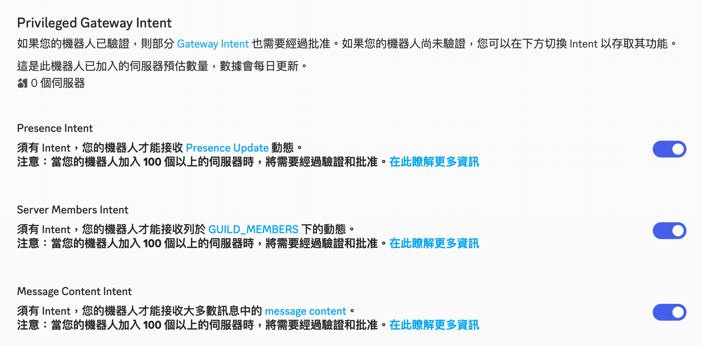
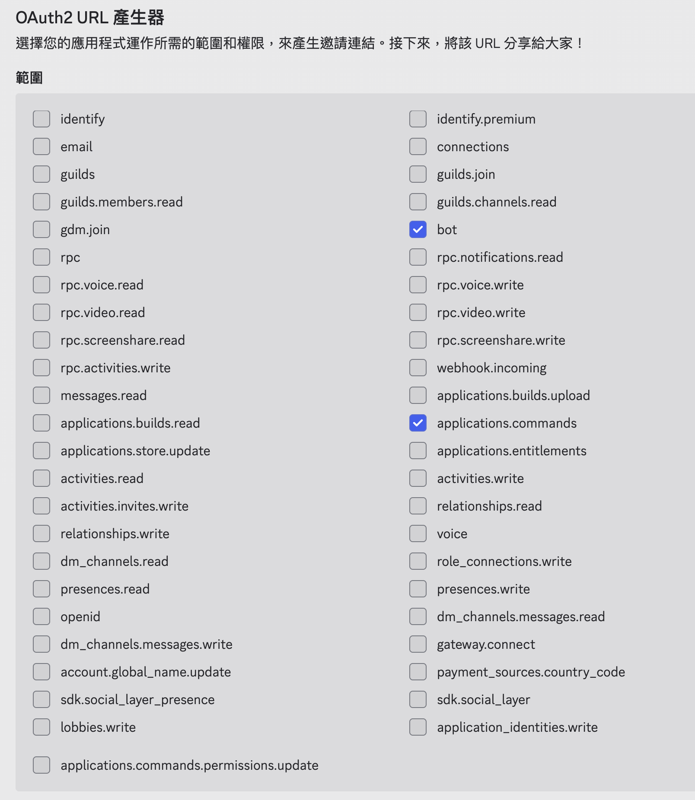
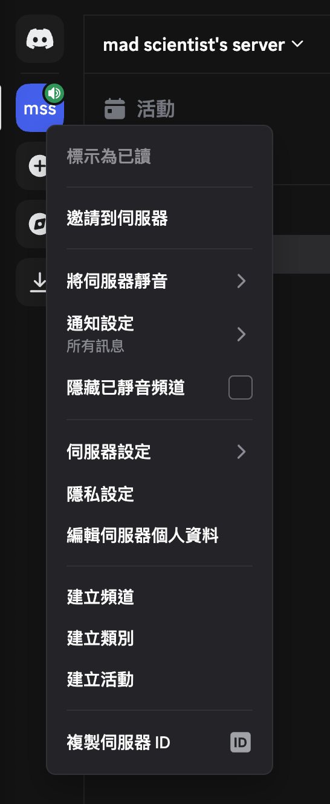

在開始串接前，我假設你已經有了
1. 運行中的 OpenClaw
2. 已註冊的 Discord 帳號
3. 一個 Discord 伺服器（如果沒有，可以自己創建一個）

## 快速設定
### 1. 創建 Discord 應用程式與機器人
- 到 Discord developer portal https://discord.com/developers/applications
- 點選右上角新建應用程式，並輸入應用程式名稱，比如`OpenClaw Bot`
- 在左側邊欄點選`機器人`，然後在使用者名稱輸入你想要的 agent 名稱，比如`OpenClaw Agent`

### 2. 啟用特權意圖（Privileged Intents）
- 把這三個選項都打開：


### 3. 複製權杖（Bot Token）
- 回到頁面前半部分，點選重設權杖（Reset Token），並將新的權杖（Token）儲存在一個安全的地方，稍後會用到

### 4. 產生邀請網址，並加入機器人
到頁面最下方選擇儲存，在左側邊欄點擊 OAuth2，我們將產生一個帶有正確權限的邀請網址，用來將機器人加入 Discord 伺服器。向下捲動到 OAuth2 URL 產生器，並啟用：
- bot
- applications.commands


下方會出現一個機器人權限區塊，啟用：
- 檢視頻道 （View Channels）
- 傳送訊息 （Send Messages）
- 讀取訊息歷史紀錄 （Read Message History）
- 嵌入連結 （Embed Links）
- 附加檔案 （Attach Files）
- 新增反應 （Add Reactions）

複製頁面底部產生 URL 的網址，貼到瀏覽器中，選擇您的伺服器，然後點擊 Continue 進行連接。現在您應該可以在 Discord 伺服器中看到您的機器人了。

### 5. 啟用開發者模式並取得 ID
- 回到 Discord 應用程式，我們需要啟用開發者模式（Developer Mode）才能複製內部 ID。前往 Discord 左下角齒輪的使用者設定 -> 最下方`進階`，啟用`開發者模式`，然後按下右上方的叉叉回到伺服器
- 在左側邊欄伺服器圖示按右鍵 → 複製伺服器 ID

- 在對話訊息內，對自己的頭像按右鍵 → 複製使用者 ID
- 把伺服器 ID 和使用者 ID 與 權杖（Bot Token）儲存在安全的地方，下一步我們會把這三個值傳給 OpenClaw

### 6. 允許伺服器成員傳送私人訊息
- 為了讓配對正常運作，Discord 需要允許機器人傳送私人訊息。在伺服器圖示按右鍵 → 隱私設定 → 開啟`私人訊息`。這會讓伺服器成員（包含機器人）可以傳送私人訊息。
- 如果想要讓 Discord 與 OpenClaw 間可以傳送私人訊息，請保持開啟。如果只打算使用伺服器頻道，而不需要私人訊息，可以在配對完成後關閉此設定。

### 7. 關於機器人權杖的安全性（不要在聊天訊息中傳送）
Discord 機器人權杖是機密資訊（類似密碼），我們會在執行 OpenClaw 的機器上設定它，之後再與 agent 對話。
在 OpenClaw 所在的終端機內執行：
```bash
export DISCORD_BOT_TOKEN="插入你儲存的機器人權杖"
openclaw config set channels.discord.token --ref-provider default --ref-source env --ref-id DISCORD_BOT_TOKEN --dry-run
openclaw config set channels.discord.token --ref-provider default --ref-source env --ref-id DISCORD_BOT_TOKEN
openclaw config set channels.discord.enabled true --strict-json
openclaw gateway
openclaw gateway restart
```

### 8. 配對 OpenClaw 與 Discord
- 在任何現有頻道（例如 Telegram）與 OpenClaw agent 對話：
> 我已經在設定中輸入 Discord 機器人權杖了。請使用以下 User ID
> <user_id>
> 和 Server ID
> <server_id>
> 完成 Discord 設定

- 如果 Discord 是第一個 OpenClaw 頻道（還沒有設置任何頻道比如 Telegram 的話），我們就必須使用 CLI 或到 OpenClaw 設定頁面，更改 openclaw.json

```javascript
{
  channels: {
    discord: {
      enabled: true,
      token: {
        source: "env",
        provider: "default",
        id: "插入你儲存的機器人權杖",
      },
    },
  },
}
```

- `channels.discord.token` 也支援 SecretRef，可搭配 env/file/exec 使用。詳見 OpenClaw 官方 [Secrets Management](https://docs.openclaw.ai/gateway/secrets)。

### 9. 核准第一次私人訊息配對（DM Pairing）
- 在 Discord 內私訊給機器人任何訊息，這會觸發配對流程。你會收到一個配對碼（pairing code）
- 在 OpenClaw agent 的現有頻道（例如 Telegram）中，送出如下的訊息：
>  核准這個 Discord 配對碼：<配對碼>
- 配對碼會在一小時後過期，如果都沒問題的話，現在你應該可以在 Discord 與 OpenClaw agent 進行對話了！


## 參考資料
OpenClaw 官方文件：
https://docs.openclaw.ai/channels/discord